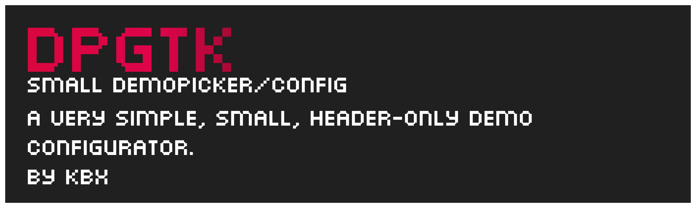
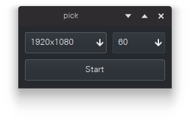
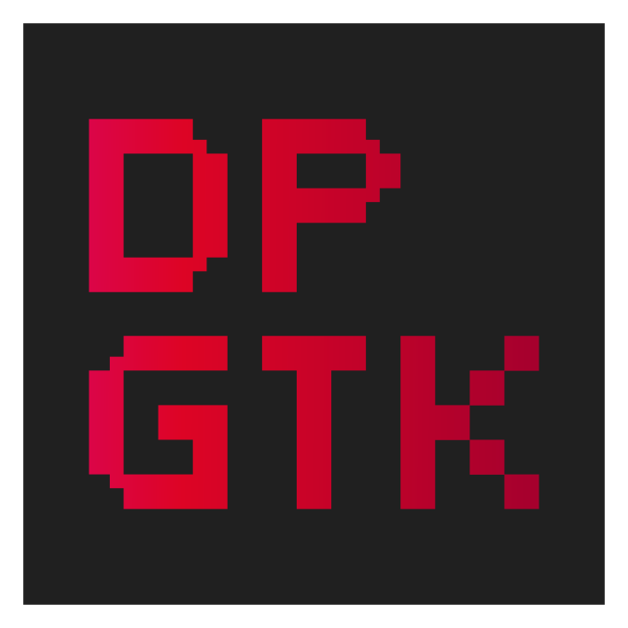

dpgtk is a small demo configurator to put at the beginning of your demos. It is header only and requires GTK. The basic program in the src/ totals up to 2188 bytes (2116 without the printf) when compiled on Arch Linux (The basic program uses some additional dependencies, which are [vondehi](https://gitlab.com/PoroCYon/vondehi) and [sstrip](https://github.com/aunali1/super-strip) to crunch down on size).

It only requires one command.

```c++
#include "dpgtk.h"

void _start(){
    ...
    int input1, input2, input3;
    dpgtk(&input1,  // Resolution width
          &input2,  // Resolution height
          &input3)  // FPS

    // run demo
}
```

<p align="center">

<br>

</p>

Licensed under the MIT license (see LICENSE file)

